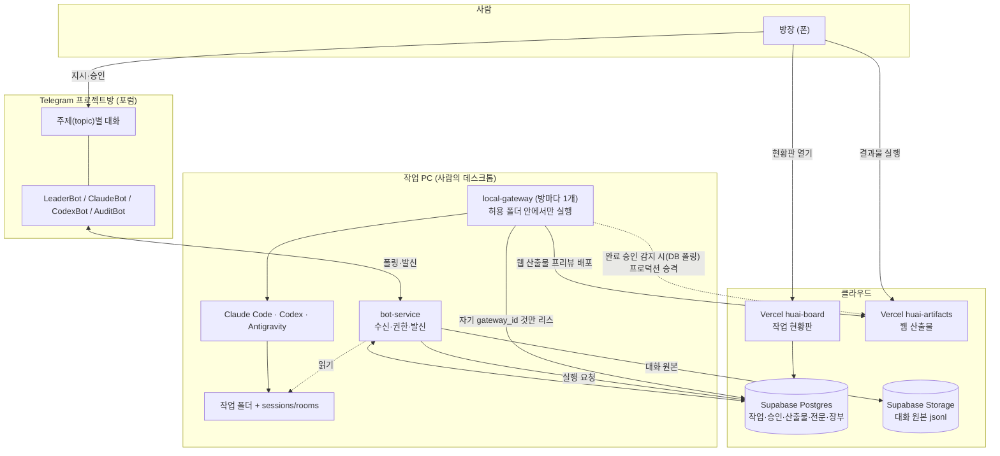

# 시스템 관계도

무엇이 무엇에 기대는지를 그린다. 실행 순서는 `작업_흐름도.md` 를 본다.

최신 갱신일: 2026-08-23

## 전체

## 왜 이렇게 갈라져 있나

**bot-service 는 텔레그램에서 직접 당겨온다(polling).** 웹훅은 공개 HTTPS 주소가 있어야
하는데, `cloudflared` 같은 무료 임시 터널은 계정 없이 5분이면 뚫리지만 URL이 재시작마다
바뀌고 아무 통보 없이 그냥 끊긴다(실측: 며칠간 끊긴 채 아무도 몰랐다). polling은 그 외부
의존이 아예 없다 — `BOT_SERVICE_RECEIVE_MODE=polling`이 기본값이고, 공개 주소를 열어야
하는 웹훅은 그게 꼭 필요한 배포(공인 도메인이 있고 안정적으로 열어둘 수 있는 경우)에서만 쓴다.

**웹 산출물은 완료 승인 전엔 프리뷰로만 공개된다.** 실행이 끝나자마자 프로덕션에 바로 올리면
방장이 승인 버튼을 누르기도 전에 결과물이 이미 공개 주소로 떠 있는 상태가 된다. 그래서 이제는
프리뷰만 먼저 올리고(방장이 눌러서 미리 볼 수 있다), 완료 승인이 실제로 기록된 뒤에만
local-gateway 의 폴러가 그 배포를 프로덕션으로 승격한다.

**bot-service 와 local-gateway 가 같은 PC 에 있다.** 그래서 bot-service 가 방 기억
(`sessions/rooms/…_위키.md`)을 디스크에서 바로 읽고, 문서 산출물도 그 자리에서 텔레그램에
올린다. 둘을 떼어놓으면 이 두 경로가 끊긴다.

**게이트웨이는 방마다 하나다.** 자기 `gateway_id` 로 온 일만 리스하고 자기 폴더 안에서만
실행한다. 개인회생 방의 실행이 회계 자료 폴더를 열 수 없고, 그 반대도 마찬가지다.

**현황판과 산출물은 Vercel 에 있다.** `*.supabase.co` 는 HTML 을 `text/plain` 으로 강제해서
올려도 소스만 보인다 — 게임을 올려도 실행되지 않는다.

**대화 원본은 Storage, 요약은 파일, 색인은 DB.** 원본은 무손실 사본이라 지우기 전 반드시
있어야 하고(텔레그램은 지난 대화를 돌려주지 않는다), 요약은 읽히기 위한 손실 압축이라 DB
용량을 쓰지 않는다.

## 데이터가 어디에 남나

| 무엇 | 어디 | 지우나 |
|---|---|---|
| 작업·승인·산출물 링크·보고 전문 | Supabase 표 | 안 지움 |
| 통신 기록(이벤트·아웃박스·수신 원본) | Supabase 표 | 60일 후, 보관 확인된 것만 |
| 대화 원본 jsonl | Supabase Storage + 로컬 | 안 지움 |
| 하루치 요약 위키 | 작업 PC `sessions/rooms/` | 안 지움 |
| 웹 산출물 | Vercel huai-artifacts | 안 지움 |

방별 최신 40턴과 최신 승인 이벤트는 나이와 무관하게 남긴다 — 리더가 읽는 창과 작업 재개
커서다. 조용한 방이 그걸 잃으면, 방장 눈에는 텔레그램에 대화가 그대로 보이는데 봇만 기억을
잃은 상태가 된다.
