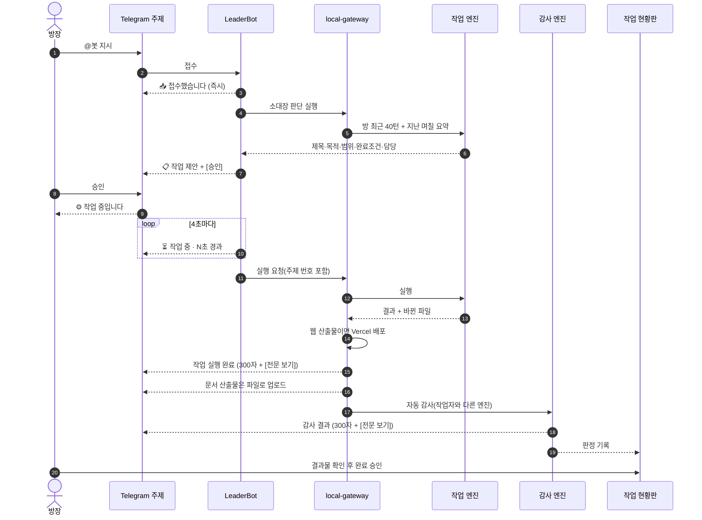
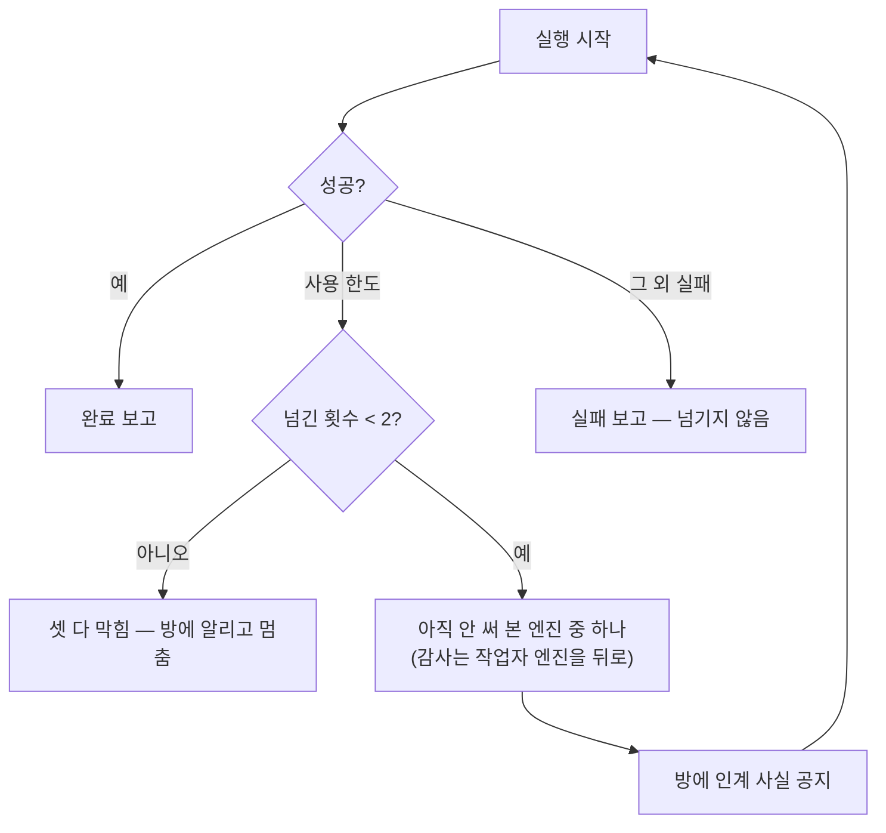

# 작업 흐름도

지시 한 줄이 결과물이 되기까지. 관계도는 `시스템_관계도.md` 를 본다.

최신 갱신일: 2026-08-17

## 정상 흐름



## 엔진이 막혔을 때



한도가 아닌 실패는 넘기지 않는다. 같은 실패를 두 번 하고 방만 시끄러워진다.

한도 판정은 CLI 가 낸 통보 형태일 때만 인정한다 — 짧고, 초기화 시각을 말한다. 결과물 본문에
"usage limit" 이 들어 있다고 한도로 읽으면, 성공한 실행이 실패로 뒤집힌다(실제로 한 번 그랬다).

## 하루가 끝나면

```mermaid
flowchart LR
  A["00:10 야간 작업"] --> B["보관: 어제까지 대화·이벤트를<br/>jsonl 로 Storage + 로컬"]
  B --> C["장부 기록<br/>날짜·행수·체크섬"]
  C --> D["요약: 하루치를 위키로<br/>sessions/rooms/&lt;방&gt;/&lt;날짜&gt;_위키.md"]
  C --> E["정리 점검 (dry-run)"]
  E -.--> F["실제 삭제는 사람이 판단"]
```

순서를 뒤집지 않는다. 텔레그램 봇은 지난 대화를 다시 읽을 수 없어서, 보관 전에 지우면 복구할
방법이 없다. 삭제는 장부에 등재된 날짜만, 60일이 지난 것만, 최신 40턴을 빼고 한다.

요약이 실패해도 보관과 정리 판단에는 영향이 없다. 요약은 손실 압축이고 조용히 실패할 수 있는데,
백업은 그러면 안 되기 때문에 파이프라인을 나눠 두었다.

## 방장이 볼 화면

| 상황 | 방에 나오는 것 | 눌러야 할 곳 |
|---|---|---|
| 지시 직후 | 📥 접수했습니다 | — |
| 제안 | 📋 작업 제안 + 버튼 | 방에서 승인 |
| 실행 중 | ⏳ 작업 중 · N초 경과 | — |
| 결과·감사 | 300자 요약 + [전문 보기] | 전문은 현황판 |
| 완료 승인 | "완료 승인은 현황판에서" | **현황판**(방에 버튼 없음) |
| 이미 결정된 건에 또 결정 | "이미 결정이 끝난 건" 안내 | 새로 지시 |
