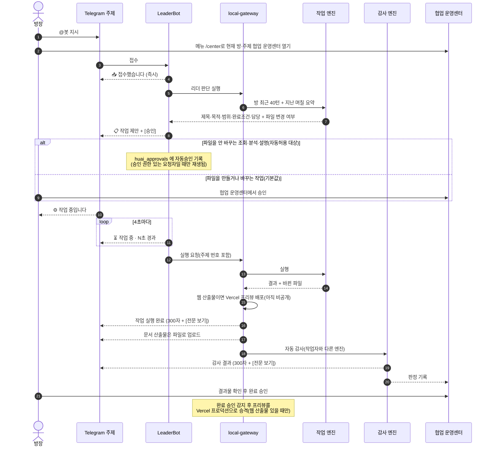
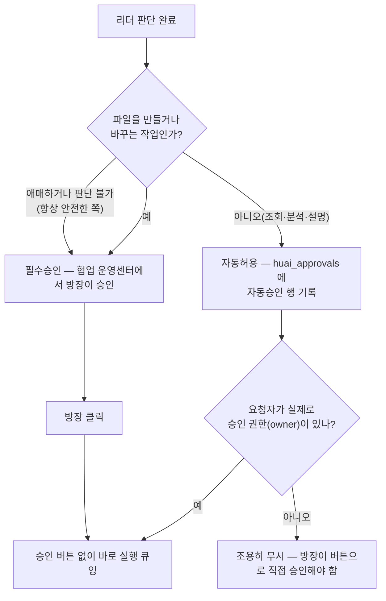
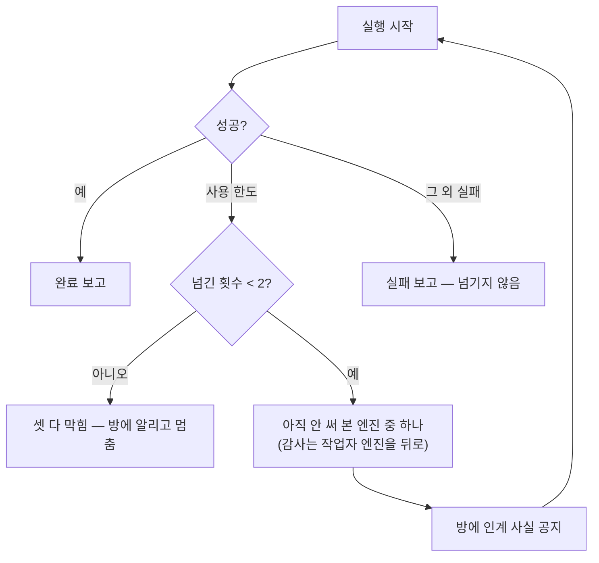

# 작업 흐름도

지시 한 줄이 결과물이 되기까지. 관계도는 `시스템_관계도.md` 를 본다.

최신 갱신일: 2026-08-28

## 정상 흐름



## 승인 카테고리 분리 (필수승인 / 자동허용)



자동허용은 새 권한이 아니다 — 자동승인 행도 텔레그램 버튼 승인과 똑같은 권한 검사
(`task:approve`, owner 전용)를 통과해야만 실행으로 이어진다. 요청자가 애초에 승인 권한이
없으면 그 행은 조용히 무시되고, 평소처럼 방장이 버튼을 눌러야 한다 — 즉 "이미 누를 수 있는
사람이 누르는 수고를 더는 것"이지 새로운 사람에게 권한을 주는 것이 아니다.

기본값은 항상 "필수승인"이다. 리더가 `MUTATES: no` 라고 명시할 때만 자동허용 대상이
된다 — 판단이 애매하면(빈 값, 오탈자, 다른 값) 코드가 승인 필요 쪽으로 떨어뜨린다.

## 엔진이 막혔을 때



한도가 아닌 실패는 넘기지 않는다. 같은 실패를 두 번 하고 방만 시끄러워진다.

한도 판정은 CLI 가 낸 통보 형태일 때만 인정한다 — 짧고, 초기화 시각을 말한다. 결과물 본문에
"usage limit" 이 들어 있다고 한도로 읽으면, 성공한 실행이 실패로 뒤집힌다(실제로 한 번 그랬다).

Codex 는 이 통보를 자기 CLI 프로토콜의 최상위 이벤트(`{"type":"error",...}`)로 보낸다 — 모델이
만든 산출물 텍스트가 아니라 CLI 자신이 보내는 통제 신호라 오탐 걱정 없이 항상 인정한다. 예전엔
이 신호를 Claude 것만 인정하도록 막아둬서, Codex 가 한도에 걸려도 사유가 "exit-code-1"로만
남고 인계는 정상 작동했지만 운영 기록에는 원인이 안 보였다(2026-08-23 수정).

## 하루가 끝나면

```mermaid
flowchart LR
  A["00:10 야간 작업"] --> B["보관: 어제까지 대화·이벤트를<br/>jsonl 로 Storage + 로컬"]
  B --> C["장부 기록<br/>날짜·행수·체크섬"]
  C --> D["요약: 하루치를 위키로<br/>sessions/rooms/&lt;방&gt;/&lt;날짜&gt;_위키.md"]
  C --> E["정리 점검 (dry-run)"]
  E -.--> F["실제 삭제는 사람이 판단"]
```

순서를 뒤집지 않는다. 텔레그램 봇은 지난 대화를 다시 읽을 수 없어서, 보관 전에 지우면 복구할
방법이 없다. 삭제는 장부에 등재된 날짜만, 60일이 지난 것만, 최신 40턴을 빼고 한다.

요약이 실패해도 보관과 정리 판단에는 영향이 없다. 요약은 손실 압축이고 조용히 실패할 수 있는데,
백업은 그러면 안 되기 때문에 파이프라인을 나눠 두었다.

## 방장이 볼 화면

| 상황 | 방에 나오는 것 | 눌러야 할 곳 |
|---|---|---|
| 지시 직후 | 📥 접수했습니다 | — |
| 제안(파일 변경 있음) | 📋 작업 제안 + 협업 운영센터 링크 | 협업 운영센터에서 승인 |
| 제안(조회성, 자동허용) | 🟢 자동 시작 안내 + 버튼(취소용) | — (권한 있으면 자동 시작) |
| 실행 중 | ⏳ 작업 중 · N초 경과 | — |
| 결과·감사 | 300자 요약 + [전문 보기] | 전문은 협업 운영센터 |
| 완료 승인 | "완료 승인은 협업 운영센터에서" | **협업 운영센터**(방에 버튼 없음) |
| 완료 승인 후(웹 산출물) | 프리뷰 링크가 프로덕션으로 승격 | — (자동) |
| 이미 결정된 건에 또 결정 | "이미 결정이 끝난 건" 안내 | 새로 지시 |

## 회귀 검증 기준

`apps/bot-service/test/synthetic-leader-planning-webhook.test.ts`는 실제 운영 연결 없이 가상 room의 방장 5001·참여자 9001 대화 4턴을 주입한다. 최근 대화가 LeaderBot 계획 요청으로 이어지고, 제목·목적·범위·완료조건을 갖춘 proposal이 생성되는지 확인한다. 실행은 `npm run build` 후 `node --test dist/apps/bot-service/test/synthetic-leader-planning-webhook.test.js`이며, 게임의 30초 생존과 공개 URL 브라우저 여정은 별도 최종 게이트다.
